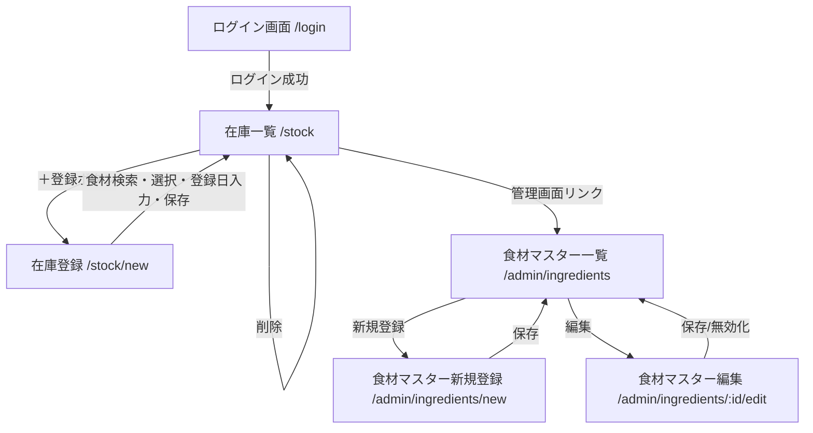
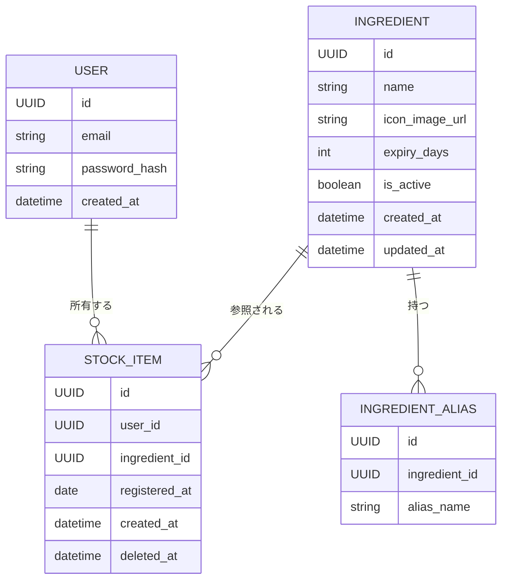

# たべごろ 開発仕様書

## 1. サービス概要

- **サービス名**: たべごろ（仮称）
- **コンセプト・解決する課題**: 冷蔵庫の中身を可視化し、賞味期限を考慮しながら食材を使い切ることで食品ロスを減らす、自分専用の食材在庫管理アプリ
- **ターゲットユーザー**: 開発者本人1人のみ。今後も他ユーザーへの展開は想定しない
- **参考サービス**: マイくら

## 2. ユースケース

1. 買い物から帰宅後、レシートを見ながらアプリを開き、食材を1つずつ登録する
2. 夜ご飯の準備前にアプリを開き、賞味期限が近い順に並んだ在庫一覧を確認し、優先的に使う食材を判断する
3. 一覧にない新しい食材を登録しようとしたとき、PCブラウザから管理画面を開き、食材マスターデータ（名称・アイコン・別名・賞味期限日数）を登録する
4. 食材を使い切った、または廃棄した際に、在庫一覧からその食材の登録を削除する

## 3. 機能要件

### 3.1 コア機能

#### 3.1.1 在庫管理（登録・削除）
- **概要**: 手元にある食材を在庫として登録し、使い切ったら削除する
- **詳細仕様**:
  - 登録項目は「食材（マスターから選択）」「登録日（デフォルトは当日、変更可）」の2つのみ。数量・単位は記録しない
  - 1つの食材を複数個購入した場合は、同じ食材で複数件の在庫登録を作成する運用とする
  - 削除操作は論理削除（ソフトデリート）とする。削除された行はDB上に履歴として残すが、アプリ・管理画面のUI上には一切表示しない
  - 削除理由（消費/廃棄の別）は区別しない。単純な削除のみ

#### 3.1.2 在庫登録時の食材検索
- **概要**: 在庫登録画面で、食材マスターからインクリメンタルに曖昧検索して選択できる
- **詳細仕様**:
  - 入力欄に文字を入力するたびに、食材名・別名（エイリアス）を対象に部分一致検索を行い候補を絞り込む
  - 検索欄が空の初期状態では、以下2種類の候補をデフォルト表示する
    - 「よく登録するもの」: 過去の在庫登録回数（論理削除済みも含めた累計登録件数）が多い順
    - 「最近登録したもの」: 直近で登録された食材（重複する食材名は除いて新しい順）

#### 3.1.3 賞味期限の残り日数表示
- **概要**: 在庫一覧で、各食材があと何日で期限を迎えるかを表示する
- **詳細仕様**:
  - 残り日数 = （登録日 + 対象食材マスターの現在の「賞味期限日数」）− 本日の日付
  - 賞味期限日数はマスターデータを後から変更した場合、既存の在庫にも即座に反映する（スナップショットは保持せず、常に最新のマスター値を参照して都度計算し直す）
  - 色分け表示（3段階）:
    - 期限切れ（残り日数 < 0）: 赤
    - 残り3日以内（0 ≤ 残り日数 ≤ 3）: 黄色
    - それ以外: 通常色

#### 3.1.4 食材マスター管理（管理者向け画面）
- **概要**: 在庫登録の元になる食材の基本データを管理する
- **詳細仕様**:
  - 管理項目: 食材名、アイコン画像（自分でアップロード）、別名リスト（検索用シノニム、複数登録可）、賞味期限の日数（整数）
  - CRUD（作成・一覧参照・編集・削除）に対応
  - 削除については、既存の在庫データが参照している場合は完全な物理削除を行わず、非表示（無効化）フラグを立てて検索候補・新規登録の選択肢から除外する運用とする（詳細は13章参照）

### 3.2 追加機能（将来対応）

- なし（最小限の機能のみで運用する方針のため、将来拡張の予定は現時点でなし）

### 3.3 管理機能

- 食材マスター管理画面（一覧・登録・編集・無効化）
- 利用者は本人のみのため、権限による機能制限（ロール分け）は行わない。ログインさえしていれば通常画面・管理画面のどちらにもアクセス可能

## 4. 画面設計

### 4.1 画面一覧

| 画面名 | パス | 概要 | 認証必要 |
|--------|------|------|---------|
| ログイン画面 | `/login` | メールアドレス・パスワードでログイン | 不要 |
| 在庫一覧画面 | `/stock` | 賞味期限が近い順にソートされた在庫リスト。色分け表示。ログイン後のデフォルト画面 | 必要 |
| 在庫登録画面 | `/stock/new` | 食材のインクリメンタル検索＋登録日入力 | 必要 |
| 食材マスター一覧画面 | `/admin/ingredients` | マスター食材の一覧・検索 | 必要 |
| 食材マスター新規登録画面 | `/admin/ingredients/new` | 食材名・アイコン・別名・賞味期限日数を登録 | 必要 |
| 食材マスター編集画面 | `/admin/ingredients/:id/edit` | 既存マスターデータの編集・無効化 | 必要 |

### 4.2 画面遷移フロー

## 5. データモデル

### 5.1 エンティティ定義

#### User（利用者）
| フィールド名 | 型 | 必須/任意 | 説明 |
|---|---|---|---|
| id | UUID | 必須 | 主キー |
| email | string | 必須 | ログインID。ユニーク |
| password_hash | string | 必須 | ハッシュ化されたパスワード |
| created_at | datetime | 必須 | 作成日時 |

#### Ingredient（食材マスター）
| フィールド名 | 型 | 必須/任意 | 説明 |
|---|---|---|---|
| id | UUID | 必須 | 主キー |
| name | string | 必須 | 食材名 |
| icon_image_url | string | 任意 | アップロードされたアイコン画像のURL |
| expiry_days | integer | 必須 | 登録日からの賞味期限日数 |
| is_active | boolean | 必須 | 無効化フラグ（false＝検索候補から除外） |
| created_at | datetime | 必須 | 作成日時 |
| updated_at | datetime | 必須 | 更新日時 |

#### IngredientAlias（食材別名）
| フィールド名 | 型 | 必須/任意 | 説明 |
|---|---|---|---|
| id | UUID | 必須 | 主キー |
| ingredient_id | UUID (FK) | 必須 | Ingredientへの参照 |
| alias_name | string | 必須 | 検索用の別名 |

#### StockItem（在庫）
| フィールド名 | 型 | 必須/任意 | 説明 |
|---|---|---|---|
| id | UUID | 必須 | 主キー |
| user_id | UUID (FK) | 必須 | Userへの参照 |
| ingredient_id | UUID (FK) | 必須 | Ingredientへの参照 |
| registered_at | date | 必須 | 登録日（賞味期限計算の起点） |
| created_at | datetime | 必須 | レコード作成日時 |
| deleted_at | datetime | 任意 | 論理削除日時。nullなら在庫中 |

### 5.2 エンティティ関係図

## 6. API設計（概要）

| メソッド | パス | 概要 |
|---|---|---|
| POST | `/api/auth/callback/credentials` | ログイン（NextAuth Credentials Provider） |
| POST | `/api/auth/signout` | ログアウト |
| GET | `/api/stock` | 在庫一覧取得（`deleted_at IS NULL`、賞味期限が近い順にソート） |
| POST | `/api/stock` | 在庫登録（ingredient_id, registered_at） |
| DELETE | `/api/stock/:id` | 在庫の論理削除 |
| GET | `/api/ingredients?q=検索文字&mode=frequent\|recent` | 食材マスター検索（名前・別名の部分一致、頻度順/最近順） |
| GET | `/api/ingredients` | 食材マスター全件一覧（管理画面用） |
| POST | `/api/ingredients` | 食材マスター新規登録 |
| GET | `/api/ingredients/:id` | 食材マスター詳細取得 |
| PUT | `/api/ingredients/:id` | 食材マスター更新 |
| DELETE | `/api/ingredients/:id` | 食材マスターの無効化（is_active=false）。参照される在庫がない場合のみ物理削除可 |
| POST | `/api/ingredients/:id/icon` | アイコン画像アップロード（クラウドストレージへ格納しURLを返却） |

## 7. 認証・権限設計

- **認証方式**: NextAuth.js の Credentials Provider によるメールアドレス＋パスワード認証（bcryptでハッシュ化して保存）
- **セッション**: JWTベースのセッションとし、`maxAge` を長期（例: 30日）に設定。PWAとして開くたびに再ログインを求められない体験を優先する
- **ロール定義**: なし。単一ユーザーが全機能にアクセス可能なため、ロールベースのアクセス制御は実装しない
- **権限マトリクス**: 認証済みユーザーであれば全画面・全APIにアクセス可能。未認証の場合は `/login` にリダイレクト

## 8. 外部サービス連携

- なし（決済・通知・SNS連携等は不要）
- 画像ストレージのみクラウドサービスを利用（8章というより技術要素だが、外部依存として明記）: 例）Vercel Blob Storage または S3互換オブジェクトストレージ

## 9. 技術スタック

| 領域 | 技術選定 | 選定理由 |
|------|---------|---------|
| フロントエンド | Next.js（React）+ PWA対応（next-pwa等） | ホーム画面追加で疑似ネイティブアプリ体験を実現でき、フルスタックで完結できるため |
| バックエンド | Next.js API Routes | フロントと同一リポジトリで完結し、個人開発の運用コストを下げられるため |
| DB | PostgreSQL | 将来的なデータ増加や複雑なクエリ（検索・集計）にも安定して対応できるため |
| 認証 | NextAuth.js（Credentials Provider） | メール＋パスワード認証と長期セッションを簡単に実装できるため |
| 画像ストレージ | Vercel Blob（またはS3互換ストレージ） | アイコン画像をクラウドに保持する要件を満たし、Vercelデプロイと親和性が高いため |
| ORM | Prisma | PostgreSQLとのスキーマ管理・マイグレーションが容易なため |

## 10. インフラ・デプロイ構成

- **構成概要**: Vercel上にNext.jsアプリをデプロイし、マネージドPostgreSQL（Vercel Postgres または Supabase等）に接続する構成を推奨
- **環境**: 個人利用のみのため、本番環境のみで運用（開発時はローカル環境＋ローカルDBまたは開発用DBインスタンスを利用）

## 11. 非機能要件

- **パフォーマンス目標**: 特別な要件なし。同時アクセスは常に1人想定
- **セキュリティ要件**: パスワードのハッシュ化（bcrypt）、HTTPS通信（Vercelのデフォルト機能で担保）。個人の食材データのみを扱うため機密性は高くないが、他人が推測しにくいパスワード運用を推奨
- **スケーラビリティ方針**: 特に考慮不要（今後もユーザー数は1人のまま拡張しない前提）

## 12. 開発フェーズ計画

### Phase 1: MVP（今回の仕様書のスコープそのもの）

- 含む機能・スコープ: 3章に記載した全機能（在庫管理、食材検索、賞味期限表示、食材マスター管理、認証）を一括で実装する
- 目標期間: 特になし

### Phase 2以降

- 現時点で計画なし

## 13. AIエージェントへの開発指示（補足）

- **実装の優先順序の目安**:
  1. DBスキーマ・Prismaモデルの定義（User, Ingredient, IngredientAlias, StockItem）
  2. 認証まわり（NextAuth Credentials Provider、長期JWTセッション設定）
  3. 食材マスターCRUD API・管理画面（`/admin/ingredients`系）
  4. 在庫CRUD API・在庫一覧/登録画面（`/stock`系）
  5. 検索機能（インクリメンタル検索、頻度順・最近順ロジック）と賞味期限の色分け表示
  6. PWA対応（manifest.json、Service Worker、ホーム画面追加対応）
- **注意点**:
  - 在庫の削除は必ず論理削除（`deleted_at`へのタイムスタンプ設定）とし、物理削除は行わないこと
  - 賞味期限の残り日数は、在庫登録時点の値をキャッシュ・スナップショットせず、表示のたびに現在のIngredientマスターの`expiry_days`を参照して都度計算すること
  - 食材マスターの削除リクエストがあった場合、該当`ingredient_id`を参照する`StockItem`が1件でも存在すれば物理削除せず`is_active=false`に更新する（在庫データの整合性を保つため）。参照が一切なければ物理削除してよい
  - 「よく登録するもの」の集計は、論理削除された`StockItem`も含めた全登録件数をカウント対象とすること（消費した実績も「よく使う食材」の判定材料になるため）
  - 数量・単位はいかなる画面・APIにも持たせないこと（同一食材の複数在庫は複数レコードで表現する）
- **実装を避けるべきパターン・禁止事項**:
  - ロールベースのアクセス制御（管理者/一般ユーザーの権限分け）は実装しないこと。単一ユーザー運用のため不要な複雑性を持ち込まない
  - レシピ提案・栄養計算・外部レシピAPI連携などは範囲外。実装しないこと
  - 数量・単位・価格などのフィールドをデータモデルに追加しないこと（要件で明確に除外されている）
